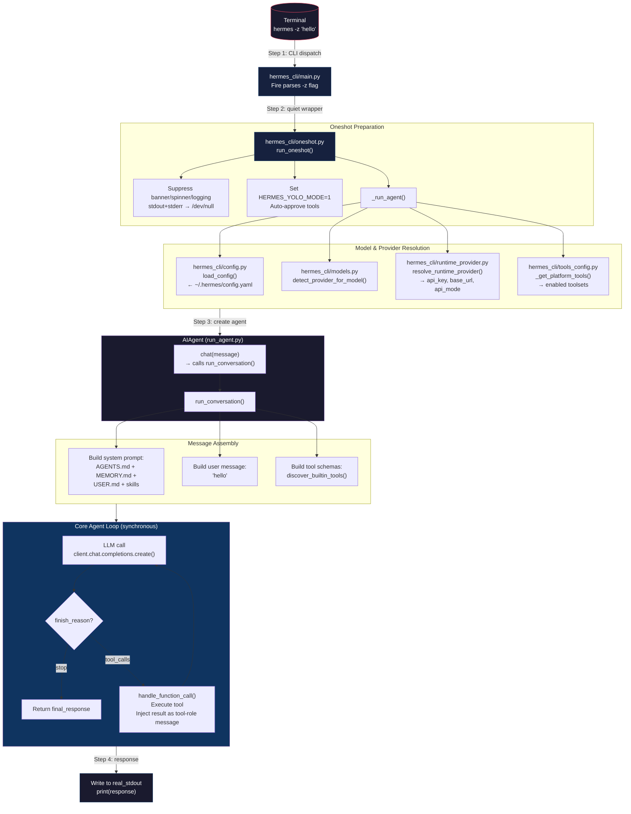

# Hermes One-Shot Request Lifecycle

```mermaid
flowchart TD
    T[("Terminal<br/>hermes -z 'hello'")]
    T -->|"Step 1: CLI dispatch"| MAIN["hermes_cli/main.py<br/>Fire parses -z flag"]
    MAIN -->|"Step 2: quiet wrapper"| ONESHOT["hermes_cli/oneshot.py<br/>run_oneshot()"]
    
    subgraph ONESHOT_PREP ["Oneshot Preparation"]
        ONESHOT --> SUPPRESS["Suppress banner/spinner/logging<br/>stdout+stderr → /dev/null"]
        ONESHOT --> YOLO["Set HERMES_YOLO_MODE=1<br/>Auto-approve tools"]
        ONESHOT --> RESOLVE["_run_agent()"]
    end
    
    subgraph RESOLVE_PROVIDER ["Model & Provider Resolution"]
        RESOLVE --> CONFIG["hermes_cli/config.py<br/>load_config()<br/>← ~/.hermes/config.yaml"]
        RESOLVE --> MODELS["hermes_cli/models.py<br/>detect_provider_for_model()"]
        RESOLVE --> RUNTIME["hermes_cli/runtime_provider.py<br/>resolve_runtime_provider()<br/>→ api_key, base_url, api_mode"]
        RESOLVE --> TOOLS["hermes_cli/tools_config.py<br/>_get_platform_tools()<br/>→ enabled toolsets"]
    end
    
    RESOLVE_PROVIDER -->|"Step 3: create agent"| AIAGENT
    
    subgraph AIAGENT ["AIAgent (run_agent.py)"]
        CHAT["chat(message)<br/>→ calls run_conversation()"]
        CHAT --> LOOP["run_conversation()"]
    end
    
    subgraph MSG_ASSEMBLY ["Message Assembly"]
        LOOP --> SYSTEM["Build system prompt:<br/>AGENTS.md + MEMORY.md +<br/>USER.md + skills"]
        LOOP --> USER_MSG["Build user message:<br/>'hello'"]
        LOOP --> TOOL_SCHEMAS["Build tool schemas:<br/>discover_builtin_tools()"]
    end
    
    MSG_ASSEMBLY --> CORE_LOOP
    
    subgraph CORE_LOOP ["Core Agent Loop (synchronous)"]
        direction TB
        LLM_CALL["LLM call<br/>client.chat.completions.create()"]
        LLM_CALL --> CHECK{"finish_reason?"}
        CHECK -->|"stop"| RESPONSE["Return final_response"]
        CHECK -->|"tool_calls"| TOOL_EXEC["handle_function_call()<br/>Execute tool<br/>Inject result as tool-role message"]
        TOOL_EXEC --> LLM_CALL
    end
    
    CORE_LOOP -->|"Step 4: response"| OUTPUT
    
    OUTPUT["Write to real_stdout<br/>print(response)"]
    
    style T fill:#1a1a2e,stroke:#e94560,color:#fff
    style MAIN fill:#16213e,stroke:#0f3460,color:#fff
    style ONESHOT fill:#16213e,stroke:#0f3460,color:#fff
    style AIAGENT fill:#1a1a2e,stroke:#533483,color:#fff
    style CORE_LOOP fill:#0f3460,stroke:#533483,color:#fff
    style OUTPUT fill:#1a1a2e,stroke:#0f3460,color:#fff
```
