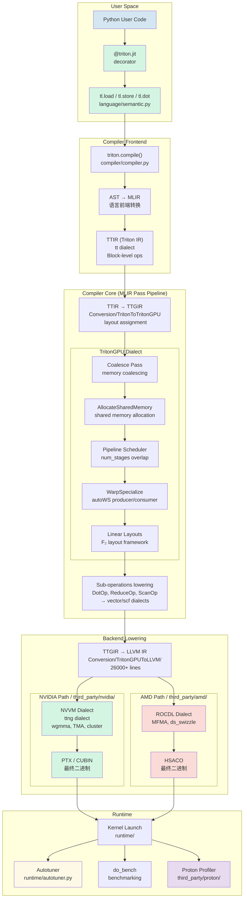
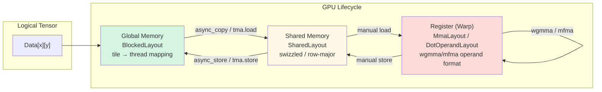

# Triton Codebase Structure & Architecture

> 一個完整的高層次架構圖 + 目錄導覽。幫助你在 1668 個檔案中找到方向。

---

## 一、高層次組件架構



---

## 二、Layout 轉換的生命週期（細化）

這是 Triton 最核心的創新，值得獨立畫出來：



關鍵 insight：同一個 tensor `Data`，在不同階段有不同的 physical layout。Compile 的責任是把 layout conversion 插入正確的位置。

---

## 三、完整目錄圖

```
triton/                                              ~502K lines, 1668 files
│
├── python/                                          ~119K lines — Python DSL + Runtime
│   ├── triton/
│   │   ├── language/                                ~8K  — tl.load, tl.store, tl.dot 等 API
│   │   │   ├── core.py                              AST node 構建
│   │   │   ├── semantic.py                          *** 最重要: DSL op → TTIR op 的語義 ***
│   │   │   ├── math.py                              數學運算
│   │   │   └── standard.py                          標準 library ops
│   │   │
│   │   ├── compiler/
│   │   │   ├── compiler.py                          *** compile() 入口, pass pipeline orchestration ***
│   │   │   ├── ir.py                                MLIR 模塊管理
│   │   │   └── make_ir.py                           AST → MLIR 轉換
│   │   │
│   │   ├── runtime/
│   │   │   ├── autotuner.py                         *** Autotuner 實作 (~500 lines) ***
│   │   │   ├── jit.py                               *** @triton.jit decorator ***
│   │   │   ├── driver/                              GPU driver abstraction (CUDA/HIP)
│   │   │   ├── cache.py                             編譯結果 cache (file-based)
│   │   │   └── interpreter.py                       解釋器模式 (不需 GPU)
│   │   │
│   │   ├── backends/                                backend 抽象層
│   │   │   └── (AMD/NVIDIA specific stubs)
│   │   │
│   │   ├── tools/                                   ~5K — 除錯/benchmark 工具
│   │   │   ├── bench.py                             do_bench
│   │   │   ├── debug.py                             除錯工具
│   │   │   └── disasm.py                            PTX disassembler
│   │   │
│   │   ├── experimental/                            ~10K — 實驗性功能
│   │   │   ├── TlX/                                 TLX (multi-warp orchestration)
│   │   │   ├── warp_specialize.py                   自動 warp specialization 工具
│   │   │   └── tensor_data_movement.py              TDM abstraction
│   │   │
│   │   ├── _C/                                      C extension bindings
│   │   └── test/                                    ~59K lines — Python tests
│   │       ├── unit/                                GPU-only pytest tests
│   │       ├── gluon/                               Gluon dialect tests
│   │       └── interpreter/                         解釋器模式 tests
│   │
│   └── triton_kernels/                              Triton 官方實作的 kernel library
│
├── lib/                                              ~67K lines — C++ Compiler
│   ├── Dialect/
│   │   ├── Triton/                                   *** Triton IR (tt dialect) ***
│   │   │   ├── IR/
│   │   │   │   ├── Ops.cpp                          op 行為實作
│   │   │   │   ├── Types.cpp                        type 實作
│   │   │   │   └── (Ops.td 在 include/ 下)          TableGen op 定義
│   │   │   └── Transforms/
│   │   │       └── ...                              tt dialect 內的 transformation passes
│   │   │
│   │   ├── TritonGPU/                               *** TritonGPU dialect (ttg dialect) — 核心 ***
│   │   │   ├── IR/
│   │   │   │   ├── Ops.cpp                          GPU-specific op 實作
│   │   │   │   └── (Attrs.td 在 include/ 下)        Layout attribute 定義
│   │   │   └── Transforms/
│   │   │       ├── Coalesce.cpp                     *** Memory coalescing ***
│   │   │       ├── AllocateSharedMemory.cpp         *** SMEM 分配 ***
│   │   │       ├── Pipeline.cpp                     *** num_stages pipelining ***
│   │   │       ├── Prefetch.cpp                     TMA prefetch
│   │   │       ├── WarpSpecialize.cpp               *** autoWS ***
│   │   │       ├── OptimizeLatency.cpp              latency hiding
│   │   │       ├── AccelerateMatmul.cpp             matmul Acceleration
│   │   │       ├── RemoveLayoutConversions.cpp      dead layout conversion elimination
│   │   │       └── ... (其他 passes)
│   │   │
│   │   ├── Gluon/                                   Gluon dialect (tensor-level IR)
│   │   │   ├── IR/
│   │   │   └── Transforms/
│   │   │
│   │   ├── TritonNvidiaGPU/                         NVIDIA-specific (ttng dialect)
│   │   │   ├── IR/
│   │   │   │   ├── (Ops.td)                         TMA, cluster op 定義
│   │   │   │   └── (Layout.td)                      NVIDIA-specific layout
│   │   │   └── Transforms/
│   │   │
│   │   └── TritonInstrument/                        Instrumentation dialect (proton)
│   │
│   ├── Conversion/
│   │   ├── TritonToTritonGPU/                      *** TTIR → TTGIR ***
│   │   │   ├── TritonGPUConversion.cpp              layout assignment logic
│   │   │   ├── TritonToTritonGPUPass.cpp            pass entry
│   │   │   └── RelayoutTritonGPU.cpp                layout conversion insertion
│   │   │
│   │   ├── TritonGPUToLLVM/                         *** TTGIR → LLVM IR (~26K lines) ***
│   │   │   ├── MemoryOpToLLVM.cpp                   tl.load → LLVM load
│   │   │   ├── DotOpToLLVM/
│   │   │   │   ├── FMA.cpp                          NVIDIA wgmma/mmma lowering
│   │   │   │   ├── FMADotUtility.cpp                AMD mfma lowering
│   │   │   │   └── ...                             混合精度、select/dtype 轉換
│   │   │   ├── ElementwiseOpToLLVM.cpp              element-wise lowering
│   │   │   ├── ReduceOpToLLVM.cpp                   reduction lowering
│   │   │   ├── Pipeline.cpp                         pipeline lowering
│   │   │   ├── ConvertLayoutOpToLLVM.cpp            layout conversion lowering
│   │   │   ├── AllocateSharedMemory.cpp             SMEM lowering
│   │   │   ├── AllocateWarpGroups.cpp               warp group allocation
│   │   │   └── WarpSpecializeUtility.cpp            warp specialization lowering
│   │   │
│   │   └── TritonInstrumentToLLVM/                  instrumentation lowering
│   │
│   ├── Analysis/
│   │   ├── Alias.cpp                                pointer alias 分析
│   │   ├── Allocation.cpp                           記憶體分配分析
│   │   ├── AxisInfo.cpp                             axis 屬性分析
│   │   ├── Membar.cpp                               memory barrier 分析
│   │   ├── BufferRegion.cpp                         buffer region analysis
│   │   └── Utility.cpp                              工具函數
│   │
│   ├── Target/
│   │   └── LLVMIR/                                  LLVM IR post-processing
│   │       ├── LLVMDIScope.cpp                      debug info 生成
│   │       ├── LLVMIRBreakPhiStruct.cpp              phi node 處理
│   │       └── ...
│   │
│   └── Tools/
│       ├── LinearLayout.cpp                         F₂ linear layout 實作
│       ├── GenericSwizzling.cpp                     swizzling 模式
│       └── LayoutUtils.cpp                          layout 工具函數
│
├── include/                                          ~17K lines — C++ Headers
│   └── triton/
│       ├── Dialect/
│       │   ├── Triton/IR/                           TableGen 定義 (.td)
│       │   ├── TritonGPU/IR/                        Layout attributes 定義
│       │   ├── TritonNvidiaGPU/IR/                  NVIDIA ops 定義
│       │   └── Gluon/IR/                            Gluon ops 定義
│       ├── Conversion/
│       │   └── TritonGPUToLLVM/                     Pass API headers
│       ├── Analysis/
│       └── Target/LLVMIR/
│
├── third_party/                                      ~180K lines — Backend-specific code
│   ├── amd/                                          *** ~120K — 最大 backend ***
│   │   ├── backend/
│   │   │   ├── compiler.py                          編譯 orchestration
│   │   │   ├── driver.py                            HIP driver wrapper
│   │   │   └── ...
│   │   ├── include/                                 AMD-specific headers
│   │   ├── lib/                                     AMD passes + conversions
│   │   └── test/                                    AMD tests
│   │
│   ├── nvidia/                                       ~31K
│   │   ├── backend/
│   │   │   ├── compiler.py                          NVIDIA compilation flow
│   │   │   └── driver.py                            CUDA driver wrapper
│   │   └── ...
│   │
│   ├── proton/                                       ~28K — Profiler
│   │   ├── lib/                                     proton C++ profiler library
│   │   └── python/                                  Python frontend
│   │
│   └── f2reduce/                                    <1K — Linear layout F₂ reduce utility
│
├── test/                                             ~81K lines — Lit tests (MLIR-level)
│   ├── Conversion/                                  Conversion tests
│   ├── Dialect/                                     Dialect tests
│   │   ├── Triton/
│   │   ├── TritonGPU/
│   │   └── TritonNvidiaGPU/
│   └── ... (other MLIR test directories)
│
├── unittest/                                         ~7K lines — Additional lit tests
│
├── bin/                                              CLI tools
│   ├── triton-opt.cpp                               *** MLIR optimization tool ***
│   ├── triton-llvm-opt.cpp                          LLVM IR optimization
│   ├── triton-reduce.cpp                            bug reduction tool
│   ├── triton-lsp.cpp                               LSP server
│   ├── triton-tensor-layout.cpp                     tensor layout visualization
│   └── RegisterTritonDialects.h                     dialect registration
│
├── docs/                                             ~25K lines — 文檔
│   ├── programming-guide/                           User guide (3 chapters)
│   ├── getting-started/tutorials/                   官方 tutorials
│   ├── backend/                                     Backend-specific docs
│   ├── gluon/                                       Gluon dialect docs
│   └── meetups/                                     Community meetup slides & notes
│
├── cmake/                                            ~<1K — CMake modules
├── examples/                                         ~1K — Example code
│   └── plugins/DialectPlugins/                      External dialect plugin 範例
│
├── scripts/                                          <1K — Build/CI scripts
├── utils/                                             <1K — Utility scripts
└── .github/                                          CI workflows, issue templates
```

---

## 四、關鍵檔案路徑速查表

### Python DSL → 編譯入口

| 你想找 | 路徑 |
|--------|------|
| `@triton.jit` decorator | `python/triton/runtime/jit.py` |
| `tl.load` / `tl.store` / `tl.dot` | `python/triton/language/semantic.py` |
| `triton.compile()` 入口 | `python/triton/compiler/compiler.py` |
| Autotuner | `python/triton/runtime/autotuner.py` |
| `do_bench` | `python/triton/tools/bench.py` |
| Interpreter (不需 GPU) | `python/triton/runtime/interpreter.py` |

### Compiler Core

| 你想找 | 路徑 |
|--------|------|
| IR → MLIR pipeline orchestration | `python/triton/compiler/make_ir.py` |
| TTIR → TTGIR conversion | `lib/Conversion/TritonToTritonGPU/` |
| TTGIR → LLVM IR 主 lowering | `lib/Conversion/TritonGPUToLLVM/` |
| `tt.load` lowering → LLVM | `lib/Conversion/TritonGPUToLLVM/MemoryOpToLLVM.cpp` |
| `tl.dot` lowering (NVIDIA)   | `lib/Conversion/TritonGPUToLLVM/DotOpToLLVM/FMA.cpp` |
| `tl.dot` lowering (AMD) | `lib/Conversion/TritonGPUToLLVM/DotOpToLLVM/FMADotUtility.cpp` |

### Optimization Passes

| Pass | 路徑 |
|------|------|
| Coalescing | `lib/Dialect/TritonGPU/Transforms/Coalesce.cpp` |
| Shared Memory Alloc | `lib/Dialect/TritonGPU/Transforms/AllocateSharedMemory.cpp` |
| Pipeline Scheduler | `lib/Dialect/TritonGPU/Transforms/Pipeline.cpp` |
| Warp Specialization | `lib/Dialect/TritonGPU/Transforms/WarpSpecialize.cpp` |
| Matmul Acceleration | `lib/Dialect/TritonGPU/Transforms/AccelerateMatmul.cpp` |
| Layout Conversion Opt | `lib/Dialect/TritonGPU/Transforms/RemoveLayoutConversions.cpp` |

### Layout 系統

| 你想找 | 路徑 |
|--------|------|
| Layout attribute 定義 | `include/triton/Dialect/TritonGPU/IR/TritonGPUAttrs.td` |
| Linear Layout C++ | `lib/Tools/LinearLayout.cpp` |
| Linear Layout 論文 | `arXiv:2505.23819` |

### Backend Orchestration

| Backend | 編譯入口 | Driver |
|---------|---------|--------|
| NVIDIA | `third_party/nvidia/backend/compiler.py` | `third_party/nvidia/backend/driver.py` |
| AMD | `third_party/amd/backend/compiler.py` | `third_party/amd/backend/driver.py` |
| AMD 的 building blocks | `third_party/amd/lib/` | — |

---

## 五、Architecture 核心閱讀策略

```
閱讀策略: Chapter → Tutorial → Code → IR dump → Iterate
                    ↑                              │
                    └──────────────────────────────┘
```

對每個 subsystem：

1. 讀官方文檔對應章節（~10 分鐘）
2. 跑對應的 tutorial / 寫最小範例（~30 分鐘）
3. 用 `TRITON_DEBUG=1` dump 該階段的 IR
4. 在 codebase 中找到對應的實作
5. 修改範例，觀察 IR 變化
6. 重複

不要試著線性讀完整個 codebase。**以 IR dump 為中心來讀** — 看到 IR 中一個 op，再去 codebase 找它的定義和 lowering。

---

## 六、常用除錯環境變數

| 變數 | 作用 |
|------|------|
| `TRITON_DEBUG=1` | 印出編譯各階段的 IR |
| `TRITON_INTERPRET=1` | 用解釋器模式 (不需 GPU) |
| `TRITON_ENABLE_LLVM_DEBUG=1` | 傳遞 `-debug` 給 LLVM，印 LLVM pass 細節 |
| `MLIR_ENABLE_DUMP=1` | 每個 MLIR pass 前後 dump IR |
| `TRITON_CACHE_DIR=/tmp/triton_cache` | 指定編譯 cache 目錄 |
| `TRITON_RESET_COMPILER_CACHE=1` | 強制 flushing cache |
